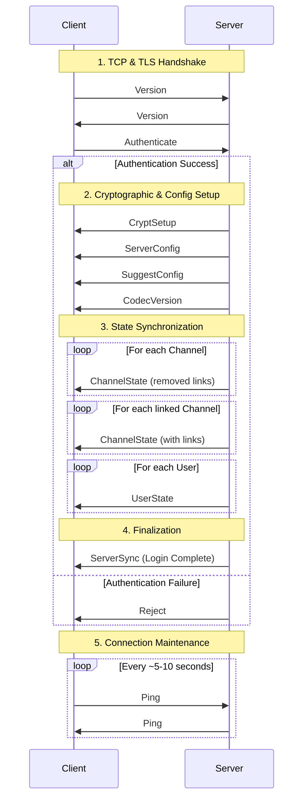

# Establishing a Mumble Connection

This document describes the process of establishing a connection between a Mumble client and an Erlmur server, following the Mumble protocol.

## Connection Overview

The connection process consists of several phases:

1. **Transport Establishment**: TCP and TLS handshake.
2. **Initial Exchange**: Version information and Authentication.
3. **Cryptographic Setup**: Preparing the UDP voice channel.
4. **State Synchronization**: Sending the current server state (channels and users).
5. **Finalization**: Completion of the login process.

## 1. Transport Establishment

The client connects to the server's TCP port (default: 64738). Immediately upon connection, a **TLS handshake** is performed.

* **Server Certificate**: The server MUST provide a certificate.
* **Client Certificate**: The client MAY provide a certificate.
    If provided, the server can use it for authentication (autologin for registered users).
* **TLS Versions**: Modern Mumble clients typically use TLS 1.2 or 1.3.

## 2. Initial Exchange

Once the TLS tunnel is established, the client and server exchange Protobuf messages.

### Version Exchange

Both parties send their version information using the `Version` message.

* **Fields**: `version` (v1/v2), `release` string, `os`, and `os_version`.
* The client sends its version first. The server replies with its own.

### Authentication

The client sends an `Authenticate` message immediately after its version.

* **Fields**: `username`, `password` (optional), `tokens` (for ACLs), `celt_versions`, and `opus` support flag.
* The server validates the credentials. If failed, it sends a `Reject` message and closes the connection.

## 3. Cryptographic Setup

After successful authentication, the server prepares the cryptographic context for the UDP voice channel.

### CryptSetup

The server sends a `CryptSetup` message.

* **Fields**: `key`, `client_nonce`, and `server_nonce`.
* These are used for **OCB-AES128** encryption of voice packets sent over UDP.
* If the client does not receive this, it will fallback to tunneling voice over TCP (UDP tunneling).

## 4. State Synchronization

The server must inform the new client about the current state of the world.

### Server Configuration

The server sends `ServerConfig` and `SuggestConfig` messages.

* `ServerConfig`: Max bandwidth, welcome text, maximum users, etc.
* `SuggestConfig`: Suggested client settings (e.g., positional audio, push-to-talk).

### Channel List

The server sends a series of `ChannelState` messages.

* **Root Channel**: The channel with ID 0 is sent first.
* **Structure**: All existing channels are sent to the client.
* **Links**: After the initial list, additional `ChannelState` messages may be sent to define links between channels.

### User List

The server sends a `UserState` message for every user currently connected to the server, including the connecting client itself.

* **Fields**: Session ID, name, channel ID, mute/deaf status, etc.

### Codec Version

The server sends a `CodecVersion` message to inform the client which codecs (Alpha, Beta, Opus) are currently in use and preferred.

## 5. Finalization

### ServerSync

The synchronization phase concludes with the server sending a `ServerSync` message.

* **Fields**: The client's assigned `session` ID, `max_bandwidth`, `welcome_text`, and `permissions` for the root channel.
* **Effect**: Once the client receives `ServerSync`, it considers itself "logged in" and ready for normal operation.

## Connection Maintenance (Ping)

To keep the connection alive, the client must periodically send `Ping` messages.

* If the server doesn't receive a `Ping` for 30 seconds, it will drop the connection.
* `Ping` messages also carry latency statistics (good/late/lost packets) used for quality metrics.

## Message Sequence Diagram

