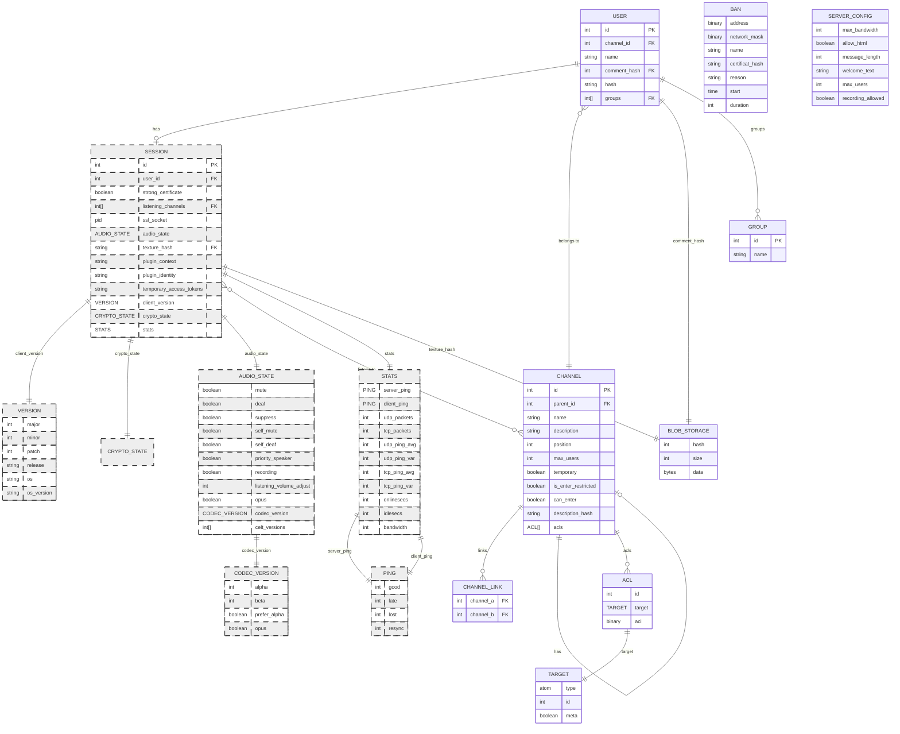

# Data

```mermaid
erDiagram

USER ||--o| SESSION : "has"
USER }o--|| CHANNEL : "belongs to"
USER ||--|| BLOB_STORAGE : "comment_hash"
USER ||--o{ GROUP : "groups"

SESSION ||--|| VERSION : "client_version"
SESSION ||--|| CRYPTO_STATE : "crypto_state"
SESSION ||--|| AUDIO_STATE : "audio_state"
SESSION }o--o{ CHANNEL : "listens to"
SESSION ||--|| STATS : "stats"
SESSION ||--|| BLOB_STORAGE : "texture_hash"

CHANNEL ||--o{ CHANNEL_LINK : "links"
CHANNEL ||--o| CHANNEL : "has"
CHANNEL ||--o{ ACL : "acls"

STATS ||--|| PING : "server_ping"
STATS ||--|| PING : "client_ping"

AUDIO_STATE ||--|| CODEC_VERSION : "codec_version"
ACL ||--|| TARGET : target

USER:::Persistent {
  int id PK
  int channel_id FK
  string name
  int comment_hash FK
  string hash
  int[] groups FK
}

BAN:::Persistent {
  binary address
  binary network_mask
  string name
  string certificat_hash
  string reason
  time start
  int duration
}

SESSION:::Ephemeral {
  int id PK
  int user_id FK
  boolean strong_certificate
  int[] listening_channels FK
  pid ssl_socket
  AUDIO_STATE audio_state
  string texture_hash FK
  string plugin_context
  string plugin_identity
  string temporary_access_tokens
  VERSION client_version
  CRYPTO_STATE crypto_state
  STATS stats
}

CRYPTO_STATE:::Ephemeral {}

CHANNEL:::Persistent {
  int id PK
  int parent_id FK
  string name
  string description
  int position
  int max_users
  boolean temporary
  boolean is_enter_restricted
  boolean can_enter
  string description_hash
  ACL[] acls
}

CHANNEL_LINK:::Persistent {
  int channel_a FK
  int channel_b FK
}

VERSION:::Ephemeral {
  int major
  int minor
  int patch
  string release
  string os
  string os_version
}

AUDIO_STATE:::Ephemeral {
  boolean mute
  boolean deaf
  boolean suppress
  boolean self_mute
  boolean self_deaf
  boolean priority_speaker
  boolean recording
  int listening_volume_adjust
  boolean opus
  CODEC_VERSION codec_version
  int[] celt_versions
}

CODEC_VERSION:::Ephemeral {
  int alpha
  int beta
  boolean prefer_alpha
  boolean opus
}

SERVER_CONFIG {
  int max_bandwidth
  boolean allow_html
  int message_length
  string welcome_text
  int max_users
  boolean recording_allowed
}

BLOB_STORAGE {
    int hash
    int size
    bytes data
}

STATS:::Ephemeral {
  PING server_ping
  PING client_ping
  int udp_packets
  int tcp_packets
  int udp_ping_avg
  int udp_ping_var
  int tcp_ping_avg
  int tcp_ping_var
  int onlinesecs
  int idlesecs
  int bandwidth
}

PING:::Ephemeral {
  int good
  int late
  int lost
  int resync
}

GROUP:::Persistent {
  int id PK
  string name
}

ACL {
  int id
  TARGET target
  binary acl
}

TARGET {
  atom type
  int id
  boolean meta
}

classDef Ephemeral fill:#eee,stroke:#333,stroke-width:2px,stroke-dasharray: 1 5
```
