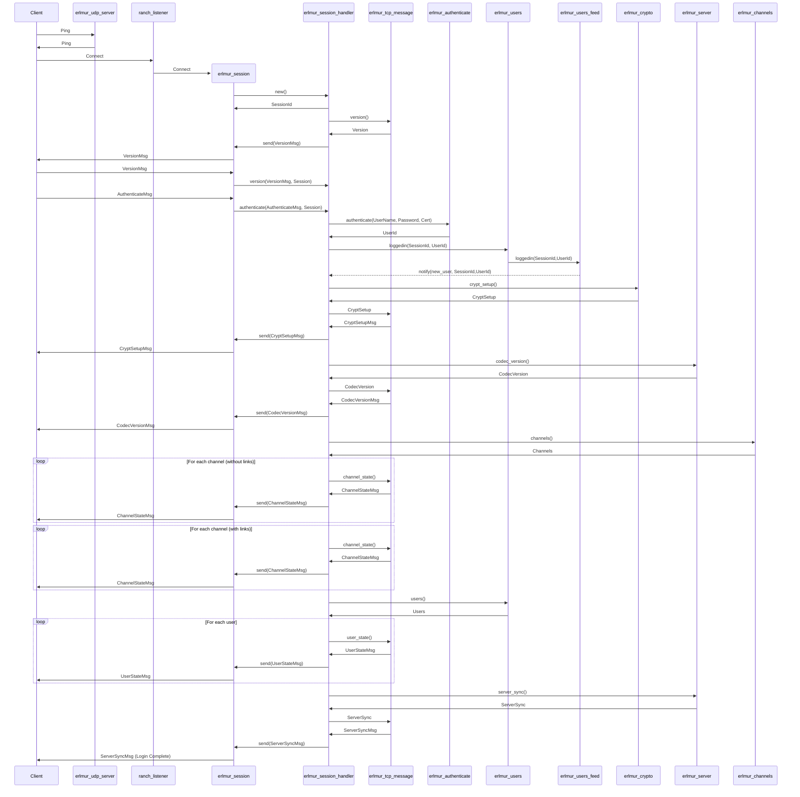
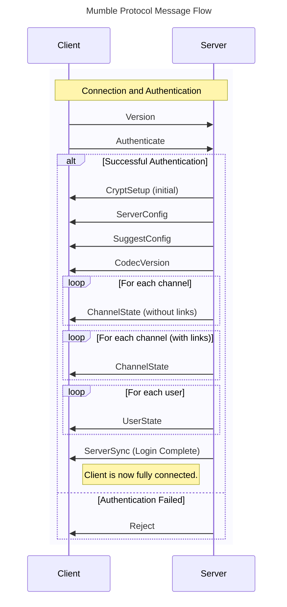
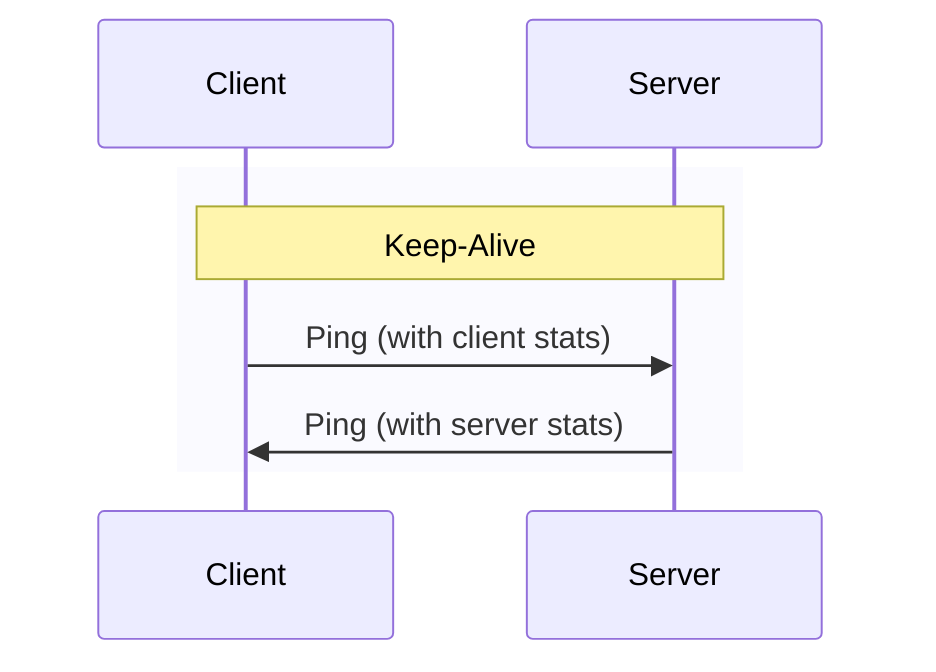
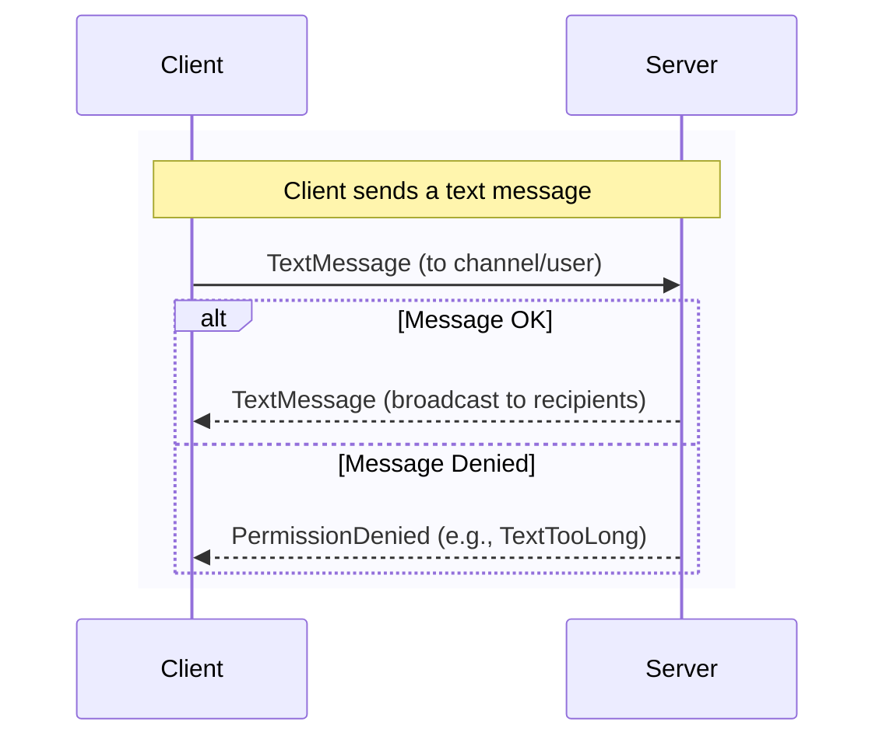
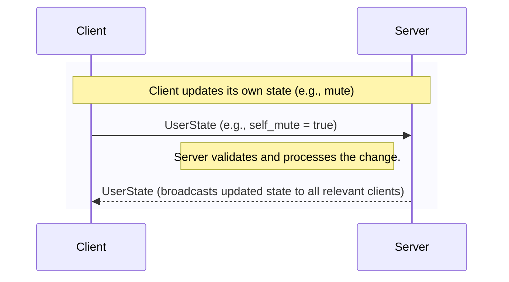
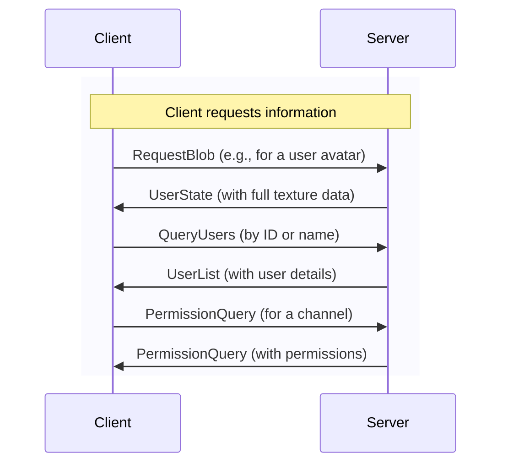
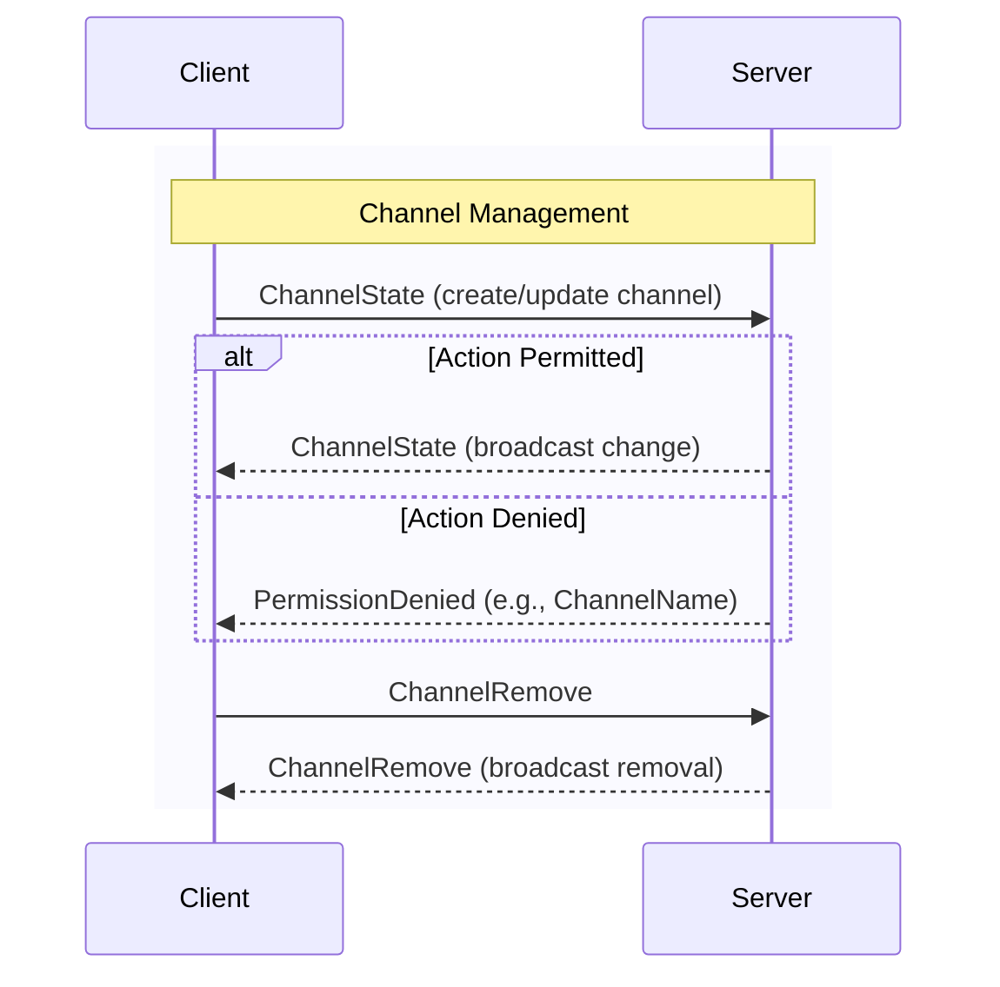
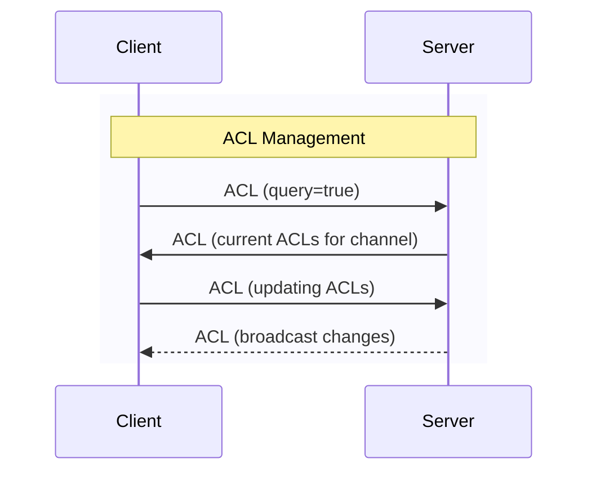
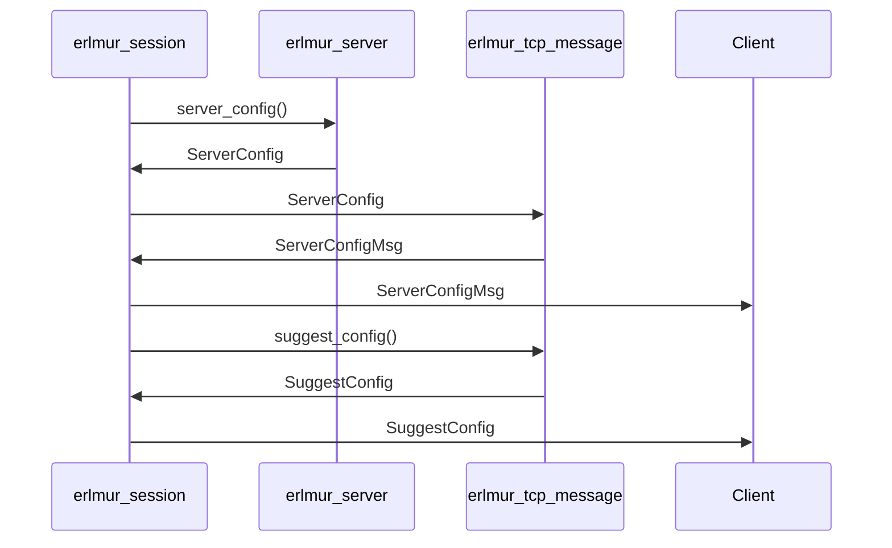

# Message flow

## Simple connect

```mermaid
sequenceDiagram
    Client->>erlmur_udp_server: Ping
    erlmur_udp_server->>Client: Ping
    Client->>ranch_listener: Connect
    create participant erlmur_session
    ranch_listener->>erlmur_session: Connect
    erlmur_session->>erlmur_session_handler:new()
    erlmur_session_handler->>erlmur_session:SessionId
    erlmur_session_handler->>erlmur_tcp_message: version()
    erlmur_tcp_message->>erlmur_session_handler: Version
    erlmur_session_handler->>erlmur_session:send(VersionMsg)
    erlmur_session->>Client: VersionMsg
    Client->>erlmur_session: VersionMsg
    erlmur_session->>erlmur_session_handler:version(VersionMsg, Session)
    Client->>erlmur_session: AuthenticateMsg
    erlmur_session->>erlmur_session_handler:authenticate(AuthenticateMsg, Session)
    erlmur_session_handler->>erlmur_authenticate:authenticate(UserName, Password, Cert)
    erlmur_authenticate->>erlmur_session_handler:UserId
    erlmur_session_handler->>erlmur_users:loggedin(SessionId, UserId)
    erlmur_users->>erlmur_users_feed:loggedin(SessionId,UserId)
    erlmur_users_feed-->>erlmur_session_handler:notify(new_user, SessionId,UserId)
    erlmur_session_handler->>erlmur_crypto: crypt_setup()
    erlmur_crypto->>erlmur_session_handler: CryptSetup
    erlmur_session_handler->>erlmur_tcp_message: CryptSetup
    erlmur_tcp_message->>erlmur_session_handler: CryptSetupMsg
    erlmur_session_handler->>erlmur_session:send(CryptSetupMsg)
    erlmur_session->>Client: CryptSetupMsg
    erlmur_session_handler->>erlmur_server: codec_version()
    erlmur_server->>erlmur_session_handler: CodecVersion
    erlmur_session_handler->>erlmur_tcp_message: CodecVersion
    erlmur_tcp_message->>erlmur_session_handler: CodecVersionMsg
    erlmur_session_handler->>erlmur_session:send(CodecVersionMsg)
    erlmur_session->>Client: CodecVersionMsg
    erlmur_session_handler->>erlmur_channels: channels()
    erlmur_channels->>erlmur_session_handler: Channels
    loop For each channel (without links)
        erlmur_session_handler->>erlmur_tcp_message: channel_state()
        erlmur_tcp_message->>erlmur_session_handler: ChannelStateMsg
        erlmur_session_handler->>erlmur_session: send(ChannelStateMsg)
        erlmur_session->>Client: ChannelStateMsg
    end
    loop For each channel (with links)
        erlmur_session_handler->>erlmur_tcp_message: channel_state()
        erlmur_tcp_message->>erlmur_session_handler: ChannelStateMsg
        erlmur_session_handler->>erlmur_session: send(ChannelStateMsg)
        erlmur_session->>Client: ChannelStateMsg
    end
    erlmur_session_handler->>erlmur_users: users()
    erlmur_users->>erlmur_session_handler: Users
    loop For each user
        erlmur_session_handler->>erlmur_tcp_message: user_state()
        erlmur_tcp_message->>erlmur_session_handler: UserStateMsg
        erlmur_session_handler->>erlmur_session: send(UserStateMsg)
        erlmur_session->>Client: UserStateMsg
    end
    erlmur_session_handler->>erlmur_server: server_sync()
    erlmur_server->>erlmur_session_handler: ServerSync
    erlmur_session_handler->>erlmur_tcp_message: ServerSync
    erlmur_tcp_message->>erlmur_session_handler: ServerSyncMsg
    erlmur_session_handler->>erlmur_session: send(ServerSyncMsg)
    erlmur_session->>Client: ServerSyncMsg (Login Complete)
```

```mermaid
sequenceDiagram
    participant C as Client
    participant S as Server

    title Mumble Protocol Message Flow

    rect rgb(250, 250, 255)
    Note over C,S: Connection and Authentication
        C->>S: Version
        C->>S: Authenticate
        alt Successful Authentication
            S->>C: CryptSetup (initial)
            S->>C: ServerConfig
            S->>C: SuggestConfig
            S->>C: CodecVersion
            loop For each channel
                S->>C: ChannelState (without links)
            end
            loop For each channel (with links)
                S->>C: ChannelState
            end
            loop For each user
                S->>C: UserState
            end
            S->>C: ServerSync (Login Complete)
            Note right of C: Client is now fully connected.
        else Authentication Failed
            S->>C: Reject
        end
    end
```

```mermaid
sequenceDiagram
    participant C as Client
    participant S as Server

    rect rgb(250, 250, 255)
    Note over C,S: Keep-Alive
        C->>S: Ping (with client stats)
        S->>C: Ping (with server stats)
    end
```

```mermaid
sequenceDiagram
    participant C as Client
    participant S as Server
    
    rect rgb(250, 250, 255)
    Note over C,S: Client sends a text message
        C->>S: TextMessage (to channel/user)
        alt Message OK
            S-->>C: TextMessage (broadcast to recipients)
        else Message Denied
            S-->>C: PermissionDenied (e.g., TextTooLong)
        end
    end
```

```mermaid
sequenceDiagram
    participant C as Client
    participant S as Server

    rect rgb(250, 250, 255)
    Note over C,S: Client updates its own state (e.g., mute)
        C->>S: UserState (e.g., self_mute = true)
        Note left of S: Server validates and processes the change.
        S-->>C: UserState (broadcasts updated state to all relevant clients)
    end
```

```mermaid
sequenceDiagram
    participant C as Client
    participant S as Server

    rect rgb(250, 250, 255)
    Note over C,S: Client requests information
        C->>S: RequestBlob (e.g., for a user avatar)
        S->>C: UserState (with full texture data)

        C->>S: QueryUsers (by ID or name)
        S->>C: UserList (with user details)

        C->>S: PermissionQuery (for a channel)
        S->>C: PermissionQuery (with permissions)
    end
```

```mermaid
sequenceDiagram
    participant C as Client
    participant S as Server

    rect rgb(250, 250, 255)
    Note over C,S: Channel Management
        C->>S: ChannelState (create/update channel)
        alt Action Permitted
            S-->>C: ChannelState (broadcast change)
        else Action Denied
            S-->>C: PermissionDenied (e.g., ChannelName)
        end

        C->>S: ChannelRemove
        S-->>C: ChannelRemove (broadcast removal)
    end
```

```mermaid
sequenceDiagram
    participant C as Client
    participant S as Server

    rect rgb(250, 250, 255)
    Note over C,S: ACL Management
        C->>S: ACL (query=true)
        S->>C: ACL (current ACLs for channel)

        C->>S: ACL (updating ACLs)
        S-->>C: ACL (broadcast changes)
    end
```

## Additional server sent config (needs investigate)

```mermaid
sequenceDiagram
    erlmur_session->>erlmur_server: server_config()
    erlmur_server->>erlmur_session: ServerConfig
    erlmur_session->>erlmur_tcp_message: ServerConfig
    erlmur_tcp_message->>erlmur_session: ServerConfigMsg
    erlmur_session->>Client: ServerConfigMsg
    erlmur_session->>erlmur_tcp_message: suggest_config()
    erlmur_tcp_message->>erlmur_session: SuggestConfig
    erlmur_session->>Client: SuggestConfig
```
